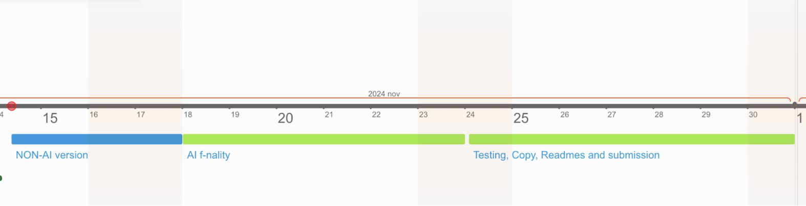
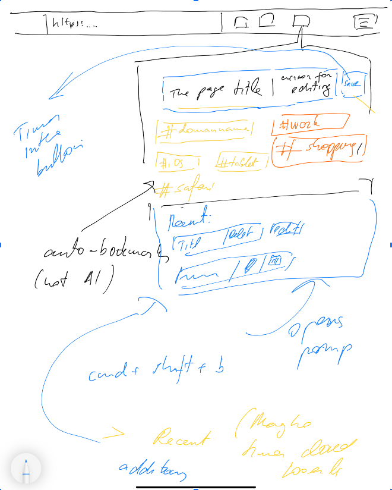
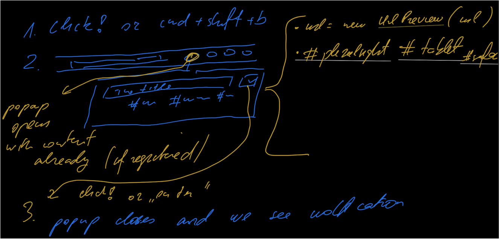

# Product Specification for TagChoose

## Executive Summary

Organizing bookmarks can be time-consuming and inefficient. _TagChoose_ streamlines this process, using AI-driven auto-tagging to eliminate categorization stress. With _TagChoose_, users can save and tag bookmarks instantly. Each tag functions as a folder in the bookmarks bar, so bookmarks appear in multiple relevant locations, making retrieval fast and effortless.

---

## Problem Statement / User Stories

### The Problem: Bookmark Overload

Online work relies heavily on browser bookmarks, but traditional bookmarking tools quickly become cluttered and hard to organize. Constantly deciding where to save links, which tags to use, and managing endless folders creates stress — wasting time and leading to lost, buried, or forgotten links. This struggle disrupts focus and adds unnecessary stress, often forcing users to re-search instead of finding saved resources.

### The Solution

Save the current tab URL through a Chrome extension popup, with the option to add/edit tags via tag-autocomplete input and AI-suggested tags from [Google AI's Prompt API](https://developer.chrome.com/docs/extensions/ai/prompt-api). The auto-categorization process requires just a few clicks. The popup opens with a keyboard shortcut, and navigation is streamlined for use with the tab key alone.

---

## Key User Stories

### Saving a Bookmark

- As a user, I’d like to be able to save the current tab URL as fast as possible, with as few clicks as possible. Adding tags should be convenient and easy to understand for a first-time user like me.

### AI Auto Tagging

- As a user, I’d like to be suggested appropriate tags for my bookmark. The tags should be pre-selected from the existing ones (existing folders in my browser).

### Folder-Tag Sync

- As a user, I’d like my folders in the bookmarks bar to represent the tags, which can be selected or auto-suggested within the Chrome extension popup.

---

## Goals and Non-Goals

### Goals

- Enable quick bookmark saving with multiple tags (in multiple folders) with just a few clicks via the extension popover.
- Offer AI-suggested tags for bookmarks, alongside options for manual tagging.
- Represent each tag as a folder in the bookmarks bar, with multi-tagged bookmarks appearing in all relevant folders for easy retrieval.

### Non-Goals

- Replicating default browser functionality for searching bookmarks and creating, deleting, moving bookmark folders.
- Allowing creating todos, reminders, and calendar entries from bookmarks.
- Allowing social network involvement and sharing, etc.
- Creating integrations with 3rd-party apps like Todoist, Notion, etc.
- Creating additional AI features in addition to auto-tagging (auto-categorization).

---

## Timeline

---

## Draft UX/UI

---

## Outstanding Questions / Further development

---

## Resources / Useful Links

- [Devpost Resources for the Google Chrome AI Challenge](https://googlechromeai.devpost.com/resources)
- [Chrome AI Developer Preview Index](https://goo.gle/chrome-ai-dev-preview-index)
- [Chrome AI Developer Preview Discussion](https://goo.gle/chrome-ai-dev-preview-discuss)
- [Google Chrome AI Challenge Details](https://goo.gle/ChromeAIChallenge)
- [Overview of Chrome Built-In AI APIs](https://developer.chrome.com/docs/ai/built-in-apis)
- [Chrome Extension AI Prompt API Documentation](https://developer.chrome.com/docs/extensions/ai/prompt-api)
- [Google Docs: Chrome AI Challenge Documentation](https://docs.google.com/document/d/1VG8HIyz361zGduWgNG7R_R8Xkv0OOJ8b5C9QKeCjU0c/edit?tab=t.0)
- [Chrome AI API Overview](https://developer.chrome.com/docs/ai)
- [@types/dom-chromium-ai NPM Package](https://www.npmjs.com/package/@types/dom-chromium-ai)
- [Google Docs: Chrome AI Usage Documentation](https://docs.google.com/document/d/1bQsMryM2ys7rX16IBfTLqPN-baV3yOlTH--rMNKfGdA/edit?tab=t.0#heading=h.9k46qmi2qcuq)
- [Google Docs: Chrome AI Prompt API Explained](https://docs.google.com/document/d/1a_w-g0BZavWsZtjI0elD6PD5utHb00cjQwvgGyTiprs/edit?tab=t.0#heading=h.oxrjk4bc6thi)
- [Material-UI Getting Started Guide](https://mui.com/material-ui/getting-started/)
- [GitHub Repository: Chrome AI Prompt API Explainers](https://github.com/explainers-by-googlers/prompt-api/)
- [Chrome Origin Trials Registration](https://developer.chrome.com/origintrials/#/registration/6595204994935291905)
- [AI Zaps Platform](https://ai.zaps.dev/)
- [Google AI Studio - Create a New Prompt](https://aistudio.google.com/prompts/new_chat)
- [GitHub Repository: Google Prompt API Documentation](https://github.com/explainers-by-googlers/prompt-api/)
- [Holt Courses: Product Management Resources](https://pm.holt.courses/)
